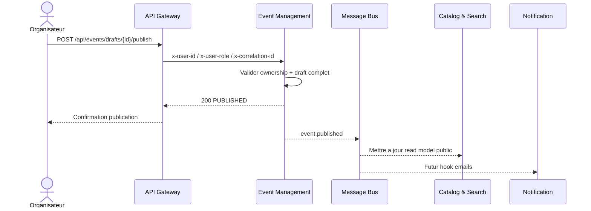

# Diagramme publication evenement

Source Mermaid canonique: `docs/diagrams/flow_event_publication.mmd`

```mermaid
sequenceDiagram
  actor Organizer as Organisateur
  participant Gateway as API Gateway
  participant EventSvc as Event Management
  participant Bus as Message Bus
  participant Catalog as Catalog & Search
  participant Notification as Notification

  Organizer->>Gateway: POST /api/events/drafts/{id}/publish
  Gateway->>EventSvc: x-user-id / x-user-role / x-correlation-id
  EventSvc->>EventSvc: Valider ownership + draft complet
  EventSvc-->>Gateway: 200 PUBLISHED
  Gateway-->>Organizer: Confirmation publication
  EventSvc-->>Bus: event.published
  Bus-->>Catalog: Mettre a jour read model public
  Bus-->>Notification: Futur hook emails
```
